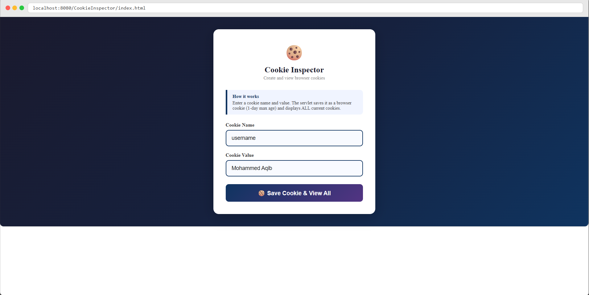
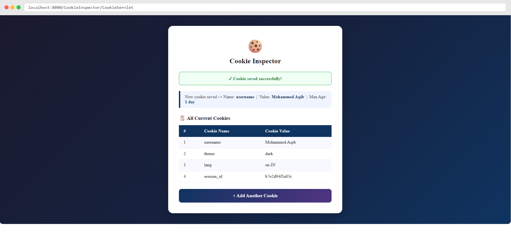

# Cookie Inspector

## Student Details

| Field       | Details                              |
|-------------|--------------------------------------|
| Name        | Mohammed Aqib Martur                 |
| USN         | 2BL23CS190                           |
| Branch      | Computer Science & Engineering       |
| Semester    | VI Semester                          |
| Subject     | Advanced Java Programming            |
| Problem No. | Problem 37                           |

## Problem Statement

This is a Cookie Inspector application built using Java Servlets. An HTML form lets the user enter a Cookie Name and Cookie Value. The Servlet creates a new cookie with a 1-day max age and saves it to the browser using response.addCookie(). It then retrieves ALL cookies currently stored by the browser using request.getCookies() and displays them in a table showing each cookie's Name and Value. A message is shown if no cookies are present.

## Technologies Used

- Java (Servlets)
- HTML, CSS (inline)
- Apache Tomcat 10
- Eclipse IDE

## How to Run This Project

1. Clone this repository or download the ZIP.
2. Import the project into Eclipse as a Dynamic Web Project.
3. Add Apache Tomcat 10 as the server in Eclipse.
4. Right-click project → Run As → Run on Server.
5. Open browser and go to: `http://localhost:8080/CookieInspector/index.html`

## Screenshots

### Input Form

### Output – All Cookies Table

## Servlet Concept Practiced

Cookie, response.addCookie(), request.getCookies(), Cookie.setMaxAge(), Input Validation, doGet/doPost
